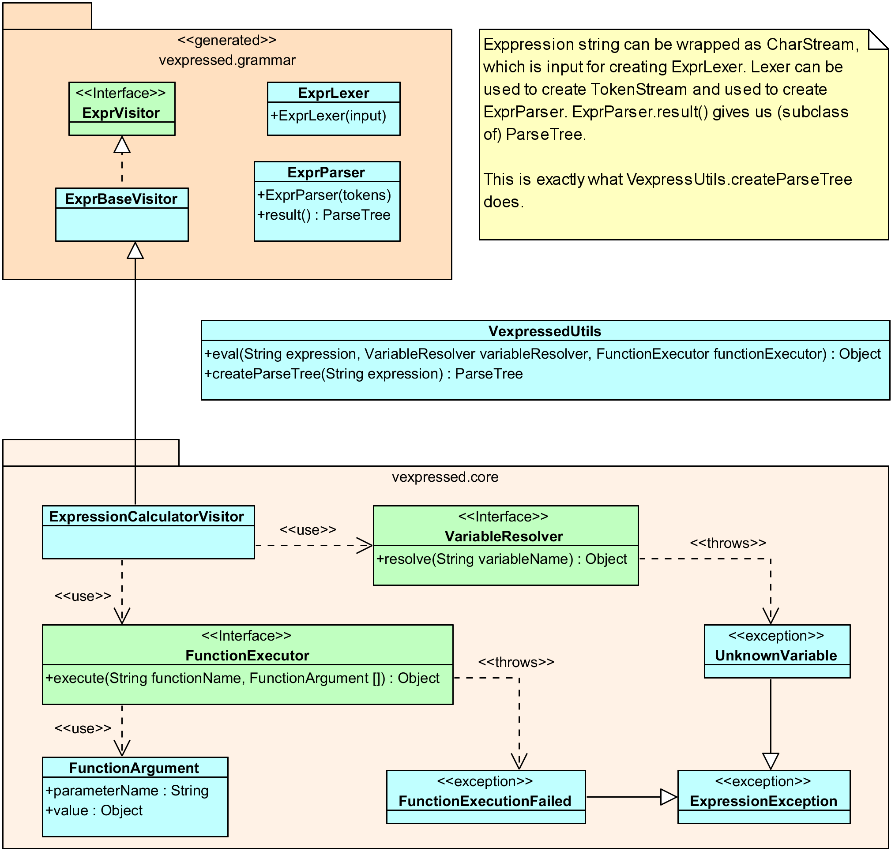

# Vexpressed

"Vexed and pressed? Use Vexpressed expression library!"

Simple to use expression evaluator and checker with support for variables and custom functions.
Built with ANTLR 4.


## Features

* Basic mathematical and logical/relational operations.
* Supported types: `INTEGER`, `DECIMAL`, `STRING`, `BOOLEAN`, `DATE`, `DATETIME`, `TIMESTAMP`
and `OBJECT`
* Simple interfaces for variable resolution and custom function execution.
* Convenient classes for definition of variable resolution.
* Easy to wrap around any Java object for variable resolution (and super-easy for `Map`).
* Custom operators (combination of +, -, *, /, ^, %, ...).
* Based on Java 8 and using lambdas a lot.

Missing but considered for future versions:

* Operator overloading (e.g. plus for other types of objects).
* Method calling on objects.
* Attribute path resolution.


## Why does it exist?

We needed something like this for our project and various expression languages seemed to heavy
for us. It also gave us full control over the grammar and opportunity to learn ANTLR 4.


## Core classes structure



## Examples

Following examples can be found in [Scrapbook.java](src/test/java/Scrapbook.java).

### Basics

Let's start with something very simple - adding two numbers together (this prints 11):
```
System.out.println("5+6 = " + VexpressedUtils.eval("5+6", NULL_VARIABLE_RESOLVER, null));
```

`VexpressedUtils.eval` does all the job for you, but because this library is not for calculating
constant results it expect you to provide some `VariableResolver` (we provide dummy
`NULL_VARIABLE_RESOLVER` here, it cannot be null) and `FunctionExecutor` (this, for a change, can
be `null`).

Normal expected precedence rules apply (power is right associative):
```
2+2^2^3/16 // returns 18 and is equivalent to: 2 + ((2^(2^3)) / 16)
```

### Variables

Let's use some variables - this is the reason why expressions are useful because variables can
change from invocation to invocation of the same expression. *Vexpressed* highest abstraction for
variable resolution is called `VariableResolver` - it takes variable name in and returns its value
(`Object`) out. In this example, any variable will return 2 and the resolver is implemented as
lambda:
```
eval("a * 3", var -> 2, null) // returns 6, because a (or any other variable) is 2
```

Of course we don't want all variables to be the same, but for that we have to define what variable
returns what. Let's say we have an object of type `Rectangle` with fields `a` and `b` and we want
to use these as variables. Firstly, we define the mapper for these variables:
```
VariableMapper<Rectangle> rectangleMapper = new VariableMapper<Rectangle>()
	.define("a", ExpressionType.INTEGER, o -> o.a)
	.define("b", ExpressionType.INTEGER, o -> o.b)
	.finish();
```

Now we can use the same mapper for the same expression, but we call `resolverFor` on the mapper
using different rectangles - this returns `VariableResolver` that resolves variables as defined
in the mapper, but "closes over" different instances and returns different values - as expected:
```
eval("a * b", rectangleMapper.resolverFor(new Rectangle(3, 4)), null) // returns 12
eval("a * b", rectangleMapper.resolverFor(new Rectangle(2, 5)), null) // returns 10
```

You can always roll in your own implementation of `VariableResolver` with the support around it,
some if it can be done easily with lambda. For instance, if you want to provide variables in
a `Map` you can simply implement it as `var -> map.get(var)`. 

### Functions

Just like with variables, functions are executed by a single very simple abstraction as well,
`FunctionExecutor` that returns an `Object` (return value) taking function name and actual
arguments as input. Let's first implement something dummy - whatever the name of function we use
we always get the sum of the arguments (assuming they are integers).
```
eval("fun(1, 2, 3) + anyotherfun(4, 5)", NULL_VARIABLE_RESOLVER,
	(name, numbers) -> numbers.stream().mapToInt(o -> (Integer) o.value).sum());
```
This produces 15, as expected.

We probably want something more useful and this is where `FunctionMapper` comes - which is similar
to how `VariableMapper` complements `VariableResolver`. First we implement our function using
a normal Java method spiced up with some annotations:
```
@ExpressionFunction
public static Integer sum(@FunctionParam(name = "nums") Collection<Integer> ints) {
	return ints.stream().mapToInt(i -> i).sum();
}
```

Then we can use this code:
```
FunctionMapper functionMapper = new FunctionMapper()
	.scanForFunctions(Scrapbook.class);
eval("sum([1, 2, 3, 4])", NULL_VARIABLE_RESOLVER, functionMapper.executor());
eval("sum(nums: [1, 2, 3, 4])", NULL_VARIABLE_RESOLVER, functionMapper.executor());
```
Obviously, we can construct function mapper only once and keep it in some field or so. When calling
the function we can also specify the name of the parameter and even change its order - unnamed
arguments will be used positionally against any unused parameter names. There is one difference
here to notice - we had to wrap the numbers into a list because `FunctionMapper` currently does not
support varargs (varargs itself does not affect our expression grammar, only the execution of the
function).

Another thing to notice is that we scanned for functions on a class (`Scrapbook.class`)
but we can also scan on an instance. This allows us to run functions implemented even on managed
components, accessing database, etc.

Finally, sometimes we want to create a specific function that uses some variable value. You can
always pass it as an argument, but what if you don't want? What if you want to use it implicitly?
All you have to do is call the `executor` method on the `FunctionMapper` with additional
`VariableResolver` parameter like this: `functionMapper.executor(variableResolver)`.
Following example is rather contrive but this mechanism can be useful to make expressions in some
situations more fluent when the function name implies the usage of the variables.
```
// This time we map non-annotated function, first is name of the function (in expression)
// then the implementing class/object (delegate), name of the method and then method
// parameter types. VariableResolver parameter is technical and not counted.
functionMapper = new FunctionMapper().registerFunction(
	"isLargerThan", Scrapbook.class, "areaLargerThan", VariableResolver.class, int.class);

VariableResolver varResolver = rectangleMapper.resolverFor(new Rectangle(3, 4));
// function is used only with one argument, the area we compare the actual area with
eval("isLargerThan(10)", varResolver, functionMapper.executor(varResolver));
varResolver = rectangleMapper.resolverFor(new Rectangle(3, 2));
eval("isLargerThan(10)", varResolver, functionMapper.executor(varResolver));

...
public static boolean areaLargerThan(VariableResolver variableResolver, int threshold) {
	int a = (int) variableResolver.resolve("a");
	int b = (int) variableResolver.resolve("b");
	return a * b > threshold;
}
```

First eval returns true because the rectangle area is 12 (larger than 10), second false (actual
area is 6).

The bottom line is that "injecting" functions into your expressions is very easy and flexible
enough. You can use provided mapper or roll in your own `FunctionExecutor` implementation
altogether.

### Custom operators

...

## TODO

* ExpressionValidatorVisitor should return not just ExpressionType, but our type + real Java type
(this allows to do better checking for comparison operator for instance)